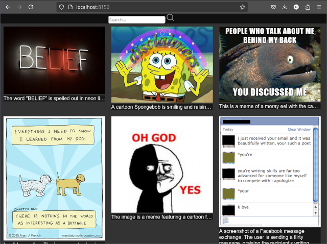
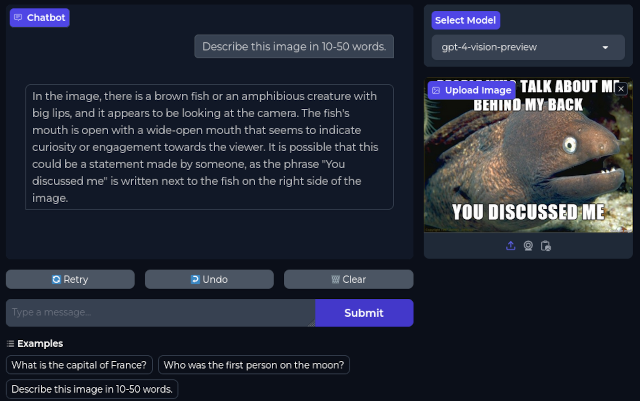

# FindAImage

Using AI image descriptions to organize memes.

 * Simple utility. Search photos in browser.
 * Offline and private. Optionally use OpenAI or Google.
 * Internet-ready. Can publish album as a website.
 * Free and open-source. NO WARRANTIES. See LICENSE.



Who doesn't have a folder of their favorite memes? But it becomes tedious scrolling through pages and pages of memes to find the right one for every occasion.

[Support development.](https://www.paypal.com/donate/?hosted_button_id=A37BWMFG3XXFG) (PayPal donation link).

## Get updates from GitHub

```bash
git clone https://github.com/themanyone/FindAImage.git
cd FindAImage
```

Or, if it's already downloaded, `git pull`.

## Python Dependencies

`pip install -r requirements.txt`

## Optional ChatGPT from OpenAI

Export `OPENAI_API_KEY` to enable ChatGPT. Edit `.bashrc`, or another startup file:

```shell
export OPENAI_API_KEY=<my API key>
```

## Optional Google Gemini

* Sign up for a [GOOGLE_API_KEY](https://aistudio.google.com)
* `pip install -q -U google-generativeai`
* `export GENAI_KEY=<YOUR API_KEY>`

## Local LLAVA server

A local server is a good way to generate captions and keep images private. [Install llama-cpp-python](https://github.com/abetlen/llama-cpp-python). If you already cloned `llama.cpp`, you can make a link to it under `llama-cpp-python/vendors` to avoid downloading it twice. Build the project using acceleration like CUDA or VULKAN, if possible. Look to the tutorial below for additional instructions on finding and downloading a LLAVA model for it.

We set up a `llama.cfg` that includes a link to our model. If you add other models, just make sure the `model_alias` contains 'vision' or 'llava' so we can identify it as a vision model. Increase `n_gpu_layers` if there is enough VRAM. [Get models from here](https://huggingface.co/hellork).

```shell
{
    "host": "0.0.0.0",
    "port": 8087,
    "root_path": "/completion",
    "models": [
        {
            "model": "/home/k/.local/share/models/llava-phi-3-mini-int4.gguf",
            "model_alias": "llava-phi-3",
            "chat_format": "llava-1-5",
            "clip_model_path":
"/home/k/.local/share/models/llava-phi-3-mini-mmproj-f16.gguf",
            "n_gpu_layers": 7,
            "offload_kqv": true,
            "n_threads": 7,
            "n_batch": 512,
            "n_ctx": 1024
        },
        
...
        
    ]
}
```

Then we make sure `AImages.py` matches the configuration we set up. If you change the above `port`, also change `LLAVA_ENDPOINT` in `FindAImage.py`. We're using port 8087 for these examples for no particular reason.

```shell
...
    elif ai_model == 'local':
        lclient = OpenAI(base_url=LLAVA_ENDPOINT, api_key="sk-xxx")
        # This uses the self-hosted path, which should be okay if the server
        # is on the same machine or network.
        url = f"{host}:{port}/images/{filename}"
        print(url)
        response = lclient.chat.completions.create(
            model = "llava-phi-3",
            messages=[
```

## Photo Album Builder

Once `llama-cpp-python` is set up and running, you can use `./FindAImage.py memes` to caption photos in the memes directory. It will print a URL for the photo album builder. `Ctrl+click` it to open it. Monitor memory usage with `nvtop`.

The link might look something like this. `http://localhost:9165`

From there, you can
- select a model from the drop-down menu in the upper-left,
- click buttons to generate captions,
- click inside text boxes to manually edit captions, 
- and save the annotated photo album.

Copy the saved `index.html` back to the directory where the images are. Launch it with a browser (or double click it in your file manager) to search images.

You can try making photo albums in other image folders.

```shell
./FindAImage.py ~/Pictures/2024
```

## Bonus Chat

After you get bored making captions for images, try out `aichat.py`. It starts a chat server so anyone on your wifi can select and chat with local LLMs, upload images (for models that support them), read and translate text in the images, or ask questions about them.



Make sure that you
- start server with  `--config_file=llama.cfg`,
- download several `.gguf` [models from here](https://huggingface.co/hellork),
- populate `llama.cfg` as in [docs](https://github.com/abetlen/llama-cpp-python).
- have at least one llava model for images.

# Linux Tutorial

This part is no longer required, but recommended. Learn to use local AI from the command line on Linux. From there we can automate caption generation of entire directories and subdirectories. The command line is where we get ideas to make this stuff.

Install at least tidy. For documentation, consider also installing `pinfo`.

Fedora, Centos.
`dnf install tidy pinfo`

Ubuntu, Debian.
`dpkg -i tidy pinfo`

Arch
`pacman -S tidy pinfo`

## Install [llama.cpp](https://github.com/themanyone/llama.cpp.git)

For this section, we are using our own unofficial fork of [llama.cpp](https://github.com/themanyone/llama.cpp.git). We have submitted our changes via pull request. If accepted, maybe the official version will become usable.

```bash
git clone https://github.com/themanyone/llama.cpp.git
git checkout hk # switch to --template branch.
```

Build according to the project's instructions.

Install by copying executables to somewhere in $PATH, such as `~/.local/bin/`.

`cp llama-* ~/.local/bin/`

Link the models directory.

```bash
cd #llama.cpp
ln -s $(pwd)/models ~/.local/share/models
```

Obtain a [llava model](https://huggingface.co/xtuner/llava-phi-3-mini-gguf/tree/main) and matching `mmproj` file from huggingface in `gguf` format.

```bash
wget -c https://huggingface.co/xtuner/llava-phi-3-mini-gguf/resolve/main/llava-phi-3-mini-int4.gguf?download=true
wget -c https://huggingface.co/xtuner/llava-phi-3-mini-gguf/resolve/main/llava-phi-3-mini-mmproj-f16.gguf?download=true
```

## Build scripts

Create a script to launch the llava model and mmproj file together with your favorite options. Running this command will recreate `~/.local/bin/llava_phi3.sh`. But maybe you should edit this in case locations are different.

```bash
cat << EOF > ~/.local/bin/llava_phi3.sh
llama-llava-cli -ngl 16 \
-m ~/.local/share/models/llava-phi-3-mini-int4.gguf \
--mmproj  ~/.local/share/models/llava-phi-3-mini-mmproj-f16.gguf \
-c 4096 "$@"
EOF
```

Now we are ready to test the model on some images. First, try a single image. Change directory to where images reside.

```bash
cd ~/Pictures
llava_phi3.sh --image file.jpg
```

## Gather image data

If that works, we can create a database in the form of a web page of the whole directory. While technically not a database, it allows visual and text searching, plus copy and paste access to photographs.

```bash
shopt -s nullglob
printf -- "--image %q " *.png *.webm *.jpg *.jpeg|xargs llava_phi3.sh -p "Write a quick, 10-50 word caption for this image. Just one caption. Minimum 10 words." --template '<figure><figcaption>[description]</figcaption></figure>' -c 4096 --log-disable | tee data
```

The `printf` `--` option tells printf not to interpret everything as options. The `%q` outputs file names with spaces and special characters properly escaped. We could have used `find` for this. The `nullglob` option to `shopt` is necessary to prevent bash from causing errors if no images are found matching [pattern]. Bash tries to pass off the glob pattern itself as one of the images. So we turn that feature off. 

You can even recurse sub-directories with `printf`, if you enable globstar `shopt -s globstar`. For more information (FYI): `pinfo bash --node "The Shopt Builtin"`.

### Update from .csv

Someday it might be necessary to update the captions, working with a subset of images in a comma-separated, quoted `.csv` file. This is made possible by reading the data into an array. FYI: `pinfo bash --node "Arrays"`

`IFS="," read -r -a a <<< "files.csv"`

Or if you have `xsel` installed. You can work with .csv data copied to the clipboard with `CTRL-C`.

`IFS="," read -r -a a <<< "$(xsel -b)"`

The `IFS` file separator tells Bash the file is comma-separated. FYI: `pinfo bash --node "Word Splitting"`

```
echo "${a[@]}"|xargs printf -- "--image %q " | xargs llava_phi3.sh -p "Write a quick, 10-50 word caption for this image. Just one caption. Minimum 10 words." --template '<figure><figcaption>[description]</figcaption></figure>' -c 4096 --log-disable | tee data
```

The `echo "${a[@]}"` echos the file names properly quoted. FYI: pinfo bash --node "Quoting". We use `xargs` repeatedly to keep file name arguments quoted as they pass through the pipeline.

## Analyze image data

Photos are processed one by one, formatting the output according to the
template we provided. We now have a data file that looks like this.

```
<figure><figcaption> The colorful television screen displays the image of a fish tank with blue, red, yellow, green, and blue elements.

</figcaption></figure><figure><figcaption> A computer monitor displaying a variety of graphs and diagrams.

</figcaption></figure><figure><figcaption> The YouTube logo is red and white.

</figcaption></figure><figure><figcaption> A small digital scale shows the number 378.

</figcaption></figure><figure><figcaption> A person plays the grand piano in an exhibition hall.

</figcaption></figure><figure><figcaption> A boat is docked at a port near a forest.

</figcaption></figure><figure><figcaption> The image shows a screenshot of a screenshot of a screenshot of a screenshot of a screenshot of a screenshot of a screenshot of a screenshot of a screenshot</figcaption></figure>
```

## Build a web page automatically

We could manually clean this `data` up to make a proper HTML page. But tools like HTML tidy already exist for that. This command builds `album.html` from `data`.

`tidy -i -o album.html data`

```
<!DOCTYPE html>
<html>
<head>
  <meta name="generator" content=
  "HTML Tidy for HTML5 for Linux version 5.8.0">
  <title></title>
</head>
<body>
  <figure>
    
    <figcaption>
      The colorful television screen displays the image of a fish
      tank with blue, red, yellow, green, and blue elements.
    </figcaption>
  </figure>
  <figure>
    
    <figcaption>
      A computer monitor displaying a variety of graphs and
      diagrams.
    </figcaption>
  </figure>
...
```

We now have a nice web page of photos with AI-generated captions. Feel free to make corrections. Let's add some CSS to make the photo album look better. Insert `<link rel="stylesheet" href="album.css">` somewhere between the <head> and </head> tags.

```
<!DOCTYPE html>
<html>
<head> 
  <meta name="generator" content=
  "HTML Tidy for HTML5 for Linux version 5.8.0">
  <title></title>
  <link rel="stylesheet" href="album.css">
</head>
...
```

And create a basic css file.

```
cat << EOF > album.css
  img{
    height:300px;
  }
  figure{
    width:350px;
    display:inline-block;
    white-space: nowrap;
  }
  figcaption {
    position: absolute;
    width: inherit;
    overflow: hidden;
    text-overflow: ellipsis;
    background: #181818;
  }
  figure:hover{
    white-space: normal;
  }
  body{
    background-color: #181818;
    color: #e0e0e0;
  }
EOF
```

## Launch the album

Rename the album to something creative. Launch the album in the default web browser. 

`xdg-open album.html`

Create a link to your album on the desktop. While viewing the album, simply drag the link in the address bar to the desktop. Or create a simlink from the command line.

`ln -s album.html ~/Desktop/`

Search for text captions in the browser by pressing `CTRL+F`. It will scroll to the image in question. Right click on your mug shots to copy them, paste them to social media, etc. You could also publish the album on a web server, [github pages](https://pages.github.com/), or [google drive](https://dev.to/matinmollapur0101/how-to-use-google-drive-to-host-your-website-1oen). Or good old-fashioned `lftp` to your server box.

## Advanced search

There is some JavaScript to alternately show and hide groups of images based on what you type into a search bar. For an example of this, look in the `memes` directory. You may use this so long as it doesn't become a hidden part of a commercial product.

## Closing thoughts

Well, that's it. We built `llama.cpp`, downloaded a llava model, made some scripts, and built a photo album. We made a searchable web page, with AI-generated image captions. And we created a shortcut on the Desktop. What else could we be doing with the help of AI?

## Discuss

    - GitHub https://github.com/themanyone
    - YouTube https://www.youtube.com/themanyone
    - Mastodon https://mastodon.social/@themanyone
    - Linkedin https://www.linkedin.com/in/henry-kroll-iii-93860426/
    - [TheNerdShow.com](http://thenerdshow.com/)

Copyright (C) 2024 Henry Kroll III, www.thenerdshow.com. See [LICENSE](LICENSE) for details.
